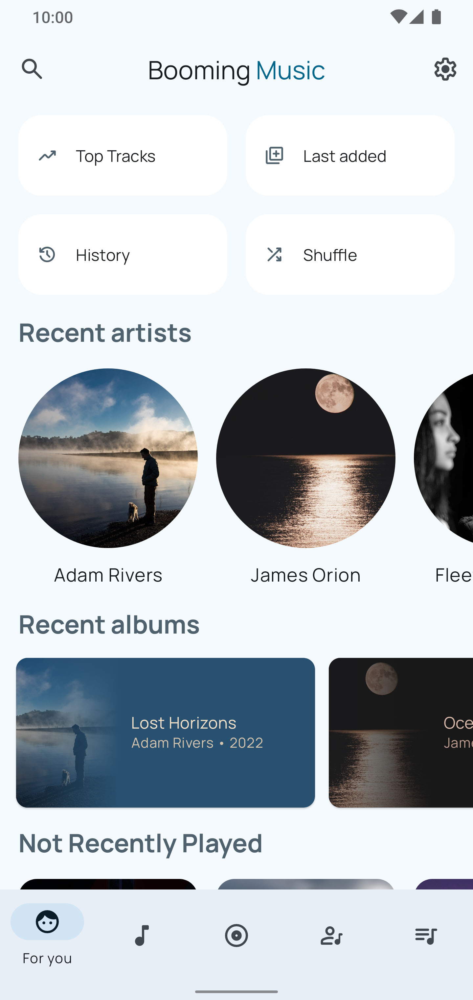
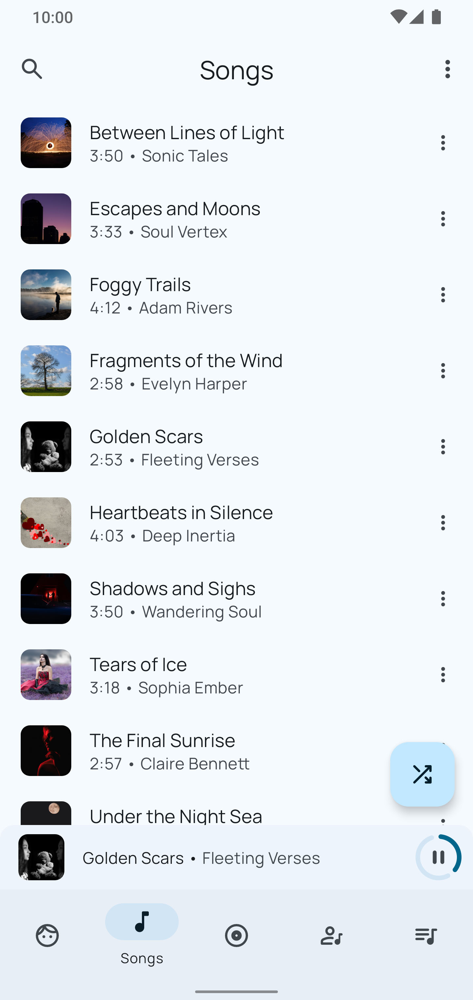
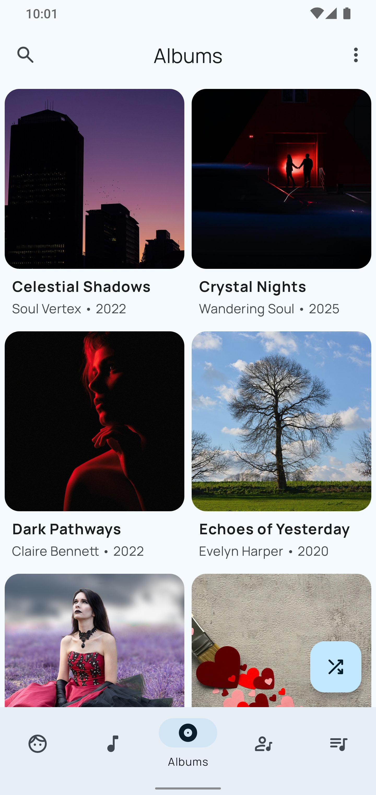
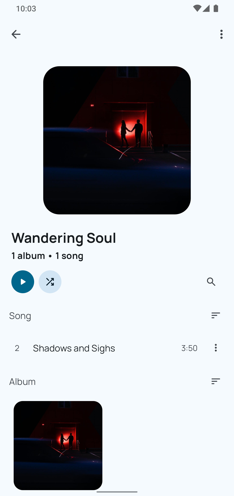
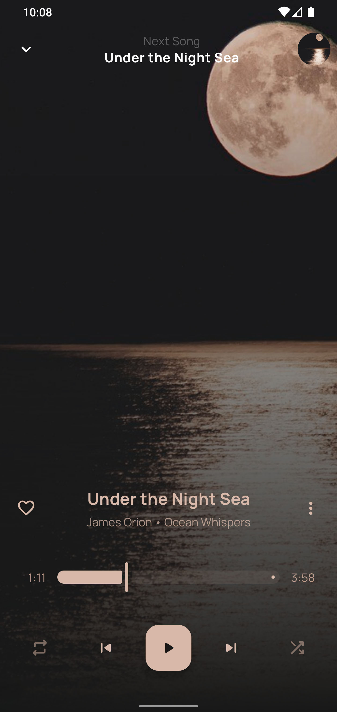
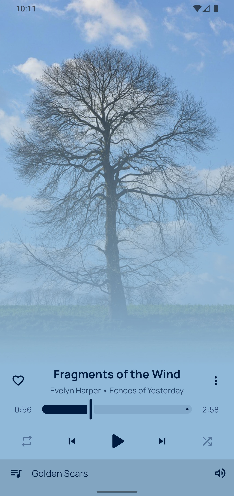
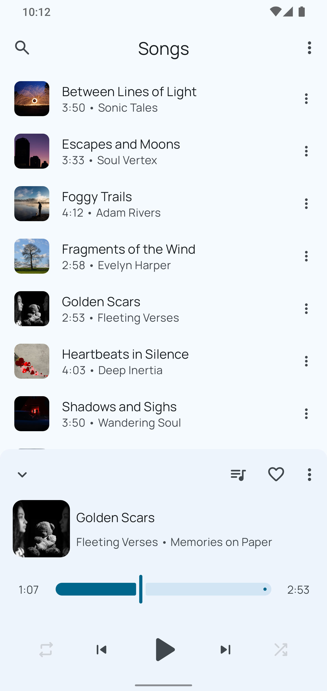

# Booming Music

### A modern, Material 3 local music player built for smooth offline listening

## 🎶 Key Features 
- **Automatic Lyrics Download & Editing**: Automatically download and sync lyrics with your music, and edit them to your preference.
- **Gapless Playback**: Enjoy uninterrupted transitions between tracks for a seamless listening experience.
- **Built-in Equalizer**: Fine-tune your audio with a built-in equalizer, and customize or share your settings.
- **Smart Playlists**: Automatically create playlists like Recently Played, Most Played, and History.
- **Bluetooth & Headset Support**: Control your music seamlessly via Bluetooth or wired headsets.
- **Android Auto Support**: Fully integrated with Android Auto for hands-free listening on the go.
- **Material You Design**: Support for Android's Material You design system, offering dynamic theming and a modern look.
- **Folder-based Browsing**: Play your music from any folder on your device.
- **Sleep Timer**: Set a sleep timer to automatically stop playback after a set time.
- **Widgets**: Add home screen and lock screen widgets for quick access and control.

## ⚙️ Additional Features 
- Monet-themed icons (Android 13+)
- Browse and organize music by songs, albums, artists, playlists, genres, and year
- Tag editor for editing song metadata
- Smart auto playlists (Recently Played, Most Played, History)
- ReplayGain support
- Automatic download of artist images
- Blacklist and whitelist support

## 📱 Screenshots

## 💿 Supported formats
Booming Music relies on native [MediaPlayer API](https://developer.android.com/guide/topics/media/mediaplayer) for audio files reproduction.
You can visit [this page](https://developer.android.com/guide/topics/media/media-formats) for detailed
information about MediaPlayer API file and format support.

## 🔒 Requested permissions
Our app requires only the necessary permissions for its operation, therefore, you can read [this document](PERMISSIONS.md)
to obtain more details about each permission and why it is required.

## 🤝 Contributing
Booming Music is an open-source project, and contributions are always welcome!
See the [Contributing](CONTRIBUTING.md) document. It will be a good starting point if you are interested
in contributing to this project, thank you very much in advance.

## 🌎 Translation
For now, pull requests are the only available way to help translate Booming Music.
We'll be uploading the project to Crowdin soon.

## 💬 Social
Join the [Telegram chat](https://t.me/mardousdev) to stay up-to-date on new releases, discuss new features,
report bugs, and engage with other community users.

## 👏 Credits
Booming Music is built upon the open-source project [Retro Music](https://github.com/RetroMusicPlayer/RetroMusicPlayer),
which served as a starting point for many features and functionality in this app.

## ⚖️ License
Booming Music is released under the GNU General Public License, which can be found [here](LICENSE.txt).
